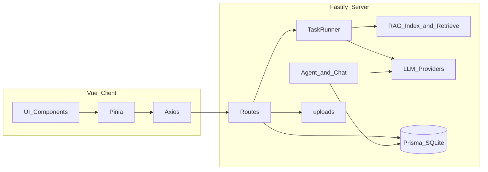

# 法盾 · AI 法律援助助手

全栈 **AI 应用**：面向当事人的案情整理、多模态证据管理与 **RAG 增强问答**，并辅助生成维权文书框架。**产出仅供参考，不构成法律意见。**

| | |
|--|--|
| **线上演示** | [http://fd.ayun.xin/](http://fd.ayuan.xin/) |
| **定位** | Vue + Node 一体化部署；大模型多厂商抽象；工具调用与向量检索落地到真实业务流 |

适合投递 **AI 应用开发 / LLM 工程化 / 全栈** 岗位时作为作品集项目说明。

---

## 我为什么做这个项目（简历一句话）

把 **长链路 AI 能力**（解析 → 归类 → 综述 → 对话 → 检索增强）收束成可上线产品：统一鉴权、异步任务、SSE 进度、对话流式输出与 **案件内 RAG**，而不是单页 Demo。

---

## AI / 工程亮点

- **多模型抽象**：`llmChat` / `llmChatStream` / `llmVision`，通过环境变量在 Anthropic、OpenAI 兼容端（含 OpenRouter、智谱等）之间切换；Embeddings 可独立配置（如与 Chat 分线路由）。
- **证据多模态**：PDF / DOCX / TXT / XLSX 文本解析；图片走视觉模型做 **结构化证据认证**（valid / group / verdict / 摘录）；前端按鉴权拉取图片 Blob，适配前后端分域部署。
- **Agent 与工具**：案件维度聊天支持工具决策（如只读 `read_evidence`、缺口分析 `check_evidence_gap`）；后台 Agent 任务与 `AgentRun` 轨迹；SSE 推送任务与聊天增量。
- **RAG（案件内）**：有效证据 **分块 → Embedding → 进程内向量索引（磁盘落盘）**；用户提问时 **向量检索 Top-K** 注入 Prompt，失败则回退证据快照，保证可用性。
- **异步与并发**：`Task` 表 + `taskRunner`（`p-limit`）；解析 / 认证 / RAG 重建等后台化，前端订阅任务流。

---

## 技术栈

| 层 | 技术 |
|----|------|
| 前端 | Vue 3 · Vite · Pinia · Vue Router · Axios |
| 后端 | Node.js · Fastify（REST + SSE） |
| 数据 | Prisma · SQLite（可换库） |
| AI | Provider 工厂 + Prompt 业务层；Embedding（OpenAI 兼容）；可选 SerpAPI 等扩展公开检索（抓取入口当前前端默认关闭，API 仍保留） |
| 认证 | JWT · bcrypt |

---

## 核心功能概览

- 注册 / 登录、演示案件、案情录入与 **AI 初始化**（证据分组与案情分析）。
- **多格式证据上传**、后台解析、批量 **AI 认证与归类**、分组展示与 ZIP 下载。
- **案件综述**：基于已认证有效证据生成结构化综述。
- **维权陈述书**：根据案情与证据生成可导出文书框架。
- **案件聊天**：流式回复、工具调用、**RAG 优先** 的证据片段注入。

---

## 架构概要



- 入口：[`server/src/index.js`](server/src/index.js)  
- AI 与 Prompt：[`server/src/services/ai.js`](server/src/services/ai.js)  
- 聊天与工具：[`server/src/agent/chatService.js`](server/src/agent/chatService.js)  
- RAG：[`server/src/services/rag/`](server/src/services/rag/)

---

## 目录结构（精简）

```
fadun/
├── package.json          # workspaces：dev / build / setup
├── .env.example
├── server/
│   ├── prisma/
│   ├── uploads/
│   └── src/
│       ├── routes/
│       ├── services/
│       ├── agent/
│       └── plugins/
└── client/src/
    ├── api/ · stores/ · views/ · components/
```

---

## 本地运行

```bash
cp .env.example .env
# 配置 JWT_SECRET、DATABASE_URL、LLM 与（可选）EMBEDDING_*、SERPAPI_API_KEY 等

npm run setup    # install + prisma db push
npm run dev      # 后端 :3000，前端 :5173（前端先等待后端就绪）
```

- 生产构建：`npm run build`（Vite 构建产物由服务端 SPA 插件托管）  
- 前后端分域时：配置 `VITE_API_BASE` 与服务端 `CORS_ORIGIN`（见 `.env.example`）

---

## 合规与边界

本平台用于学习与产品形态演示；**不替代执业律师意见**。线上环境请妥善保管 API Key 与用户数据策略。

---

## License

私有 / 作品集用途为主；若开源请自行补充许可证。

