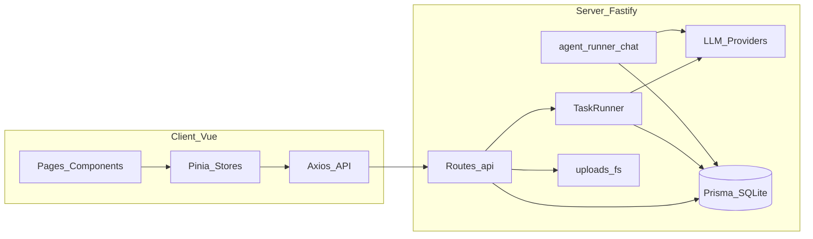

# 法盾 · AI 法律援助平台

面向当事人的案件材料整理与维权陈述辅助工具：录入案情、上传多格式证据、AI 辅助归类与说明，并生成可导出的维权陈述书框架。**输出仅供参考，不构成法律意见。**

---

## 技术栈

| 层 | 技术 |
|----|------|
| 前端 | Vue 3 + Vite + Pinia + Vue Router + Axios |
| 后端 | Node.js + Fastify（REST + 部分 SSE） |
| 数据库 | Prisma ORM + **SQLite**（`DATABASE_URL`） |
| AI | **可切换**：Anthropic Claude，或与 OpenAI 兼容的接口（OpenAI / DeepSeek / **OpenRouter** 等，见 `.env.example`） |
| 认证 | JWT（`@fastify/jwt`），密码 bcrypt |
| 异步任务 | 自建 `Task` 表 + `taskRunner`（`p-limit`），进度通过 SSE 推送 |

---

## 核心功能

- **注册 / 登录**：手机号 + 密码，JWT 访问 API。
- **演示案件**：新用户可带一条「示例」案件（部分能力受限，如不上传真实证据）。
- **案情录入与 AI 初始化**：保存案件后触发 AI 生成个性化证据分组与初始案情分析。
- **案件综述（有效证据驱动）**：基于 **已认证有效证据** 生成/更新结构化「案件综述」，写入案件并展示。
- **多格式证据**：支持图片、PDF、DOCX、TXT 等上传；解析阶段抽取文本（图片解析在认证阶段走视觉模型）。
- **异步认证与进度**：证据解析 / AI 认证排队为后台任务，前端通过 **SSE**（`/api/tasks/:id/stream`）展示进度；支持批量认证时的并发控制。
- **证据列表与下载**：证据分组、草稿箱；存在 **用户上传的非演示证据** 时可打包下载 ZIP。
- **维权陈述书**：基于案情与有效证据生成文书，可预览/导出（详见文书相关接口与前端）。
- **案件助手 Agent（后台）**：`AgentRun` 审计轨迹，工具如证据缺口检查、用户通知等；前端可触发运行（具体入口以当前界面为准）。
- **案件维度聊天**：右下角悬浮入口，多轮会话入库；**流式回答**；意图侧可调用 **`read_evidence`（案情+有效证据只读）**、**`check_evidence_gap`（缺口/补证）** 等工具（由 `chatService` 决策）。

---

## 项目架构（概要）



- **入口**：[`server/src/index.js`](server/src/index.js) 注册插件、路由、`taskRunner`；静态资源 + SPA 由 `plugins/static.js` / `plugins/spa.js` 处理。
- **API 前缀**：`/api/auth`、`/api/cases`、`/api/evidence`、`/api/ai`、`/api/tasks`、`/api/agent`。
- **AI 抽象**：[`server/src/services/providers/`](server/src/services/providers/)（`llmChat` / `llmChatStream` / `llmVision`）→ 具体厂商在 `anthropic.js`、`openai.js`。
- **业务 Prompt 与案情逻辑**：[`server/src/services/ai.js`](server/src/services/ai.js)（分组、分析、证据认证、案件综述、文书等）。
- **Agent**：[`server/src/agent/runner.js`](server/src/agent/runner.js)（工具循环 + `AgentRun`）；[`server/src/agent/chatService.js`](server/src/agent/chatService.js)（聊天 + 工具决策 + 流式）；[`server/src/agent/tools/index.js`](server/src/agent/tools/index.js)（工具注册，含 `read_evidence`、`check_evidence_gap`、`notify_user`）。

---

## 项目结构（目录）

```
fadun/
├── package.json              #  workspaces：根脚本 dev / build / setup
├── .env.example              # 环境变量模板（勿提交真实 Key）
├── server/
│   ├── prisma/schema.prisma
│   ├── uploads/              # 证据文件（运行时使用）
│   └── src/
│       ├── index.js
│       ├── plugins/          # db、jwt、cors、static、spa
│       ├── middleware/auth.js
│       ├── routes/           # auth、cases、evidence、ai、tasks、agent
│       ├── services/
│       │   ├── ai.js
│       │   ├── auth.js
│       │   ├── demo.js
│       │   ├── fileParser.js
│       │   ├── taskRunner.js
│       │   ├── logger.js
│       │   └── providers/    # index、openai、anthropic
│       └── agent/
│           ├── tools/index.js
│           ├── runner.js
│           └── chatService.js
└── client/
    └── src/
        ├── api/
        ├── stores/
        ├── views/
        ├── components/
        │   ├── auth/、cases/、evidence/、analysis/、document/
        │   ├── agent/        # 聊天等
        │   ├── layout/、ui/
        └── assets/css/
```

---

## 快速启动

### 1. 环境变量

```bash
cp .env.example .env
```

按 `.env.example` 注释配置：**JWT_SECRET**、**DATABASE_URL**、**LLM_PROVIDER** 及对应 **API Key / BASE_URL / MODEL** 等。

### 2. 安装与数据库

```bash
npm run setup
```

### 3. 一键开发启动

```bash
npm run dev
```

- 开发时常见：前端 **http://localhost:5173**，后端 **http://localhost:3000**，API 前缀 **/api**。
- 生产构建：`npm run build`（构建前端资源，由服务端 SPA 插件托管）。

---
